Email Checker Application in Spring boot.
======================================

**Intro**
--------
This application will connect to a gmail account and will save the email information on an in-memory DB 
if in the subject or email body contain a particular word.
 
To perform this task, a cron was created to run every 30 seconds to check emails from this account.
If the emails match with the criteria (DevOps word in the body or subject), the information will be 
saved in DB. 
By default, the application will read the "UNSEEN" messages, because, for testing purposes, if we read each email,
will take a long time, but, if you want to check all the emails from the inbox folder, 
the steps are detailed in the Pre Requisites section

**Pre Requisites**
--------
- In order to run this application, you will need to have installed git, Maven and Java 11 in your machine.
  References: 
   
  Install git: https://gist.github.com/derhuerst/1b15ff4652a867391f03
   
  Install Maven: https://www.baeldung.com/install-maven-on-windows-linux-mac
   
  Install java: https://www.java.com/en/download/help/index_installing.html
      

- In order to get emails from gmail, you need to go to this gmail page 
  https://www.google.com/settings/security/lesssecureapps and enable unsecure access
  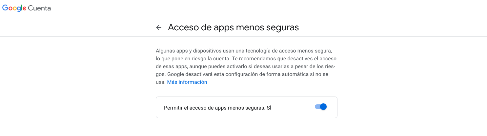
- Clone the code from the following url: https://github.com/magrellet/email-checker  
- Some pre-configuration needs to be added in the application properties file (located inside /src/main/resources).
  By default, host, protocol, port, etc are already set, but you need to add your email 
  account and your password. Also, as I mention above, by default is set to read "unseen" messages.
  If you want to read all, we can edit the key "mail.search.term" to blank or empty 
  (using default values in the code not currently working well).
  Also, if for some reason you need to run the application in a particular port, edit this key "server.port"
  to another port of preference.
  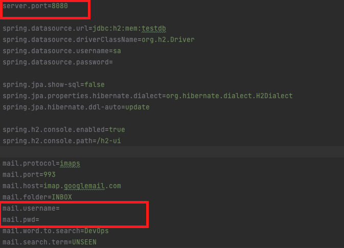
  
**Project Structure**
----------
**Controller** - The endpoints of the service. For testing purposes there is a GET API calling  
http://localhost:8080/api/email . In order to test the application working, 
we need just to call GET http://localhost:8080/api/email with no headers or parameters

**Model** - The business objects, in this case Email class.

**Repository** - The datasource access layer. Currently, using H2DB (in-memory) DB

**Service** - the business logic of the service.

**Dto** - Data transfer object to be retrieved.

**Exception** - Custom Exceptions for this application

**How to Build and Run The Application**
--------
- In order to run this application, you will need to have installed Maven and Java 11 in your machine as was mention before.
    

- To run the application without IDE, as a standalone service, you need go to the project folder and first run:
    
  **mvn package**
    
  Then run
    
  **java -jar target/email-0.0.1.jar --spring.config.location=/path/to/your/properties/application.properties**
    
  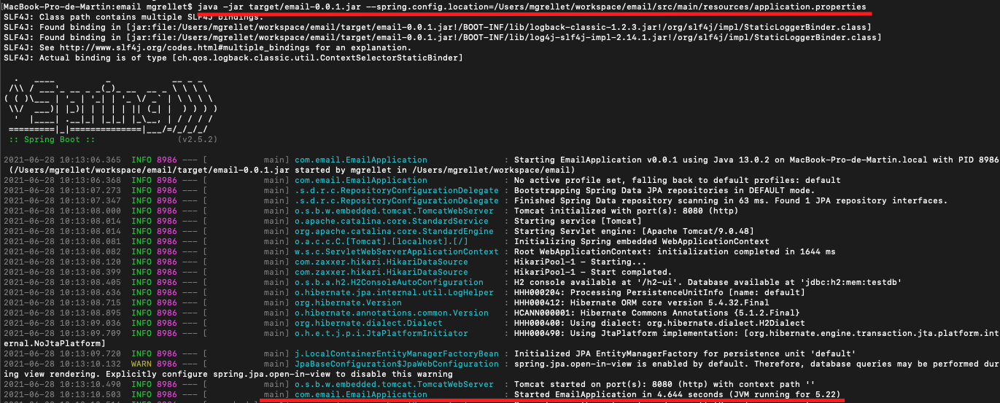
    
  Other option, would be
    
  **mvn spring-boot:run**

- Another option to run the application is using an IDE that already have maven embedded, 
  you will need to install a plugin for Lombok library in order to be able to detect 
  Lombok Annotations. For example, for IntelliJ IDEA:
  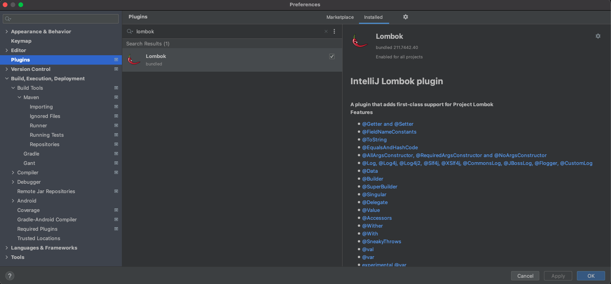

- To Run the application using an IDE, you need to set some configurations in order to download the
  dependencies and run the application.

  **Run it with Maven**
    
  (For example in IntelliJ IDEA)
    
  <i>clean install</i>.
    
  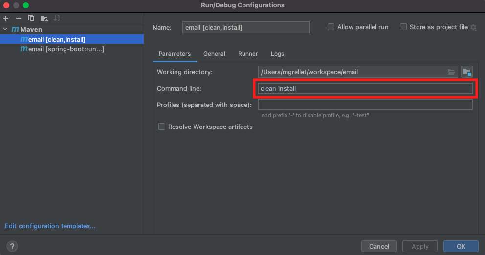
    
  <i>springboot:run</i>
    
  
    
  Note: -Dspring-boot.run.fork=false was added in orden to debug and stop the code in breakpoints.
    

**How test the Application**
---------------------------------------
Assuming your start the service on port 8080 (by default) you have this 3 following options.
- You can go to the swagger ui page: http://localhost:8080/swagger-ui/
    
  When you enter to the page, you will see a list of APIs (in this case, just one)
  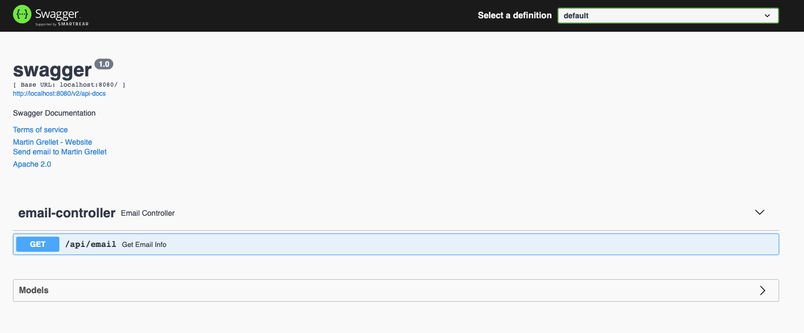
    
  You can click there and click in Try it out button, then execute.
    
  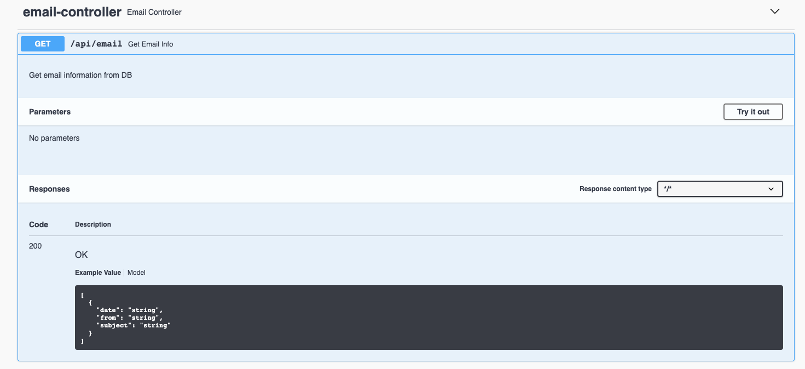
    
  From Swagger page, you can test the application and see the response in the browser
    
  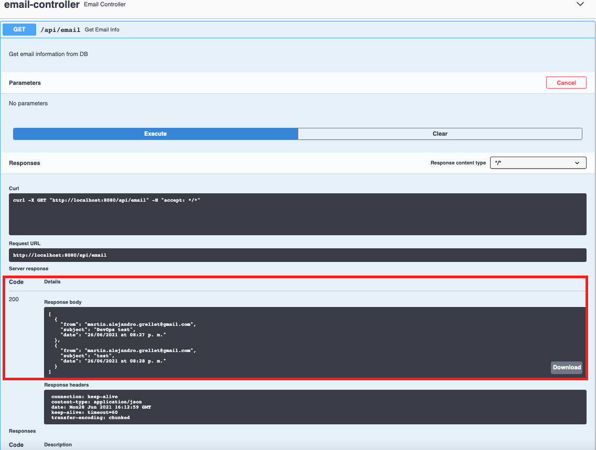
    

- Also, you can go to the DB Dashboard, login in with the default credentials (like the image below)
http://localhost:8080/h2-ui/login.jsp
    
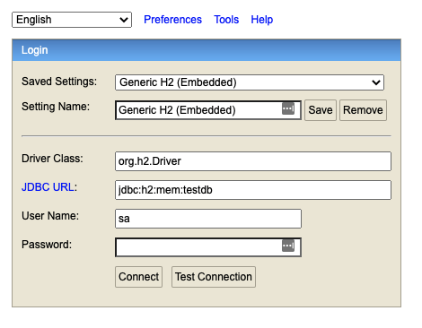
    
Then do a select to the EMAIL table
    
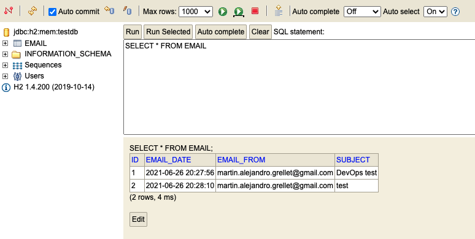
    
- Another option is to send the request using an external tool to this url:
    
  GET http://localhost:8080/api/email.
  (No headers or parameters needed)
  For example:
    
  <b>Postman</b>
  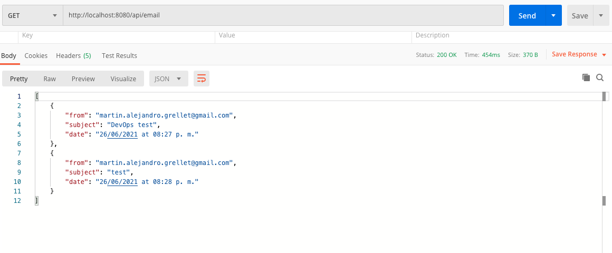
    
  <b>Browser</b>
    
  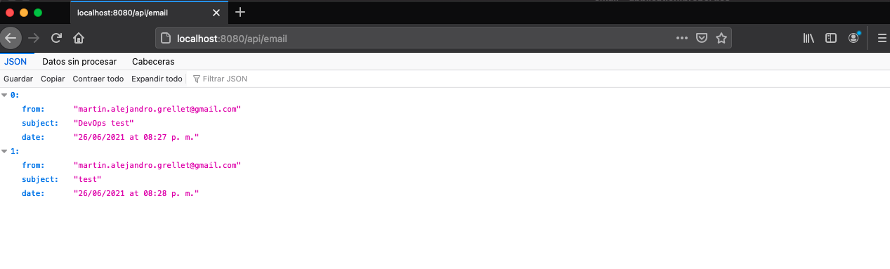
  