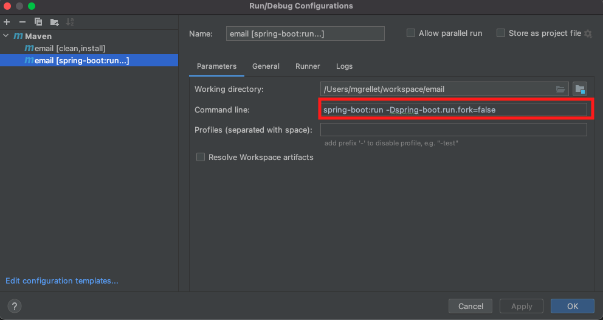

Email Checker Application in Spring boot.
======================================

**Intro**
--------
This application will connect to a gmail account and will save in in-memory DB the emails if in the subject or email 
body contain a particular word.  
To perform this task, a cron was created to run every 30 seconds to check emails from this account.
If the emails match with the criteria (DevOps word in the body or subject), the information will be 
saved in in-memory DB. 
By default, the application will read the "UNSEEN" messages, because, for testing purposes, if we read each email,
will take a long time, but, if you want to check all the emails from the inbox folder, 
the steps are in the Pre Requisites section

**Pre Requisites**
--------
- In order to run this application, you will need to have installed Maven and Java 11 in your machine.
- In order to get emails from gmail, you need to go to this gmail page 
  https://www.google.com/settings/security/lesssecureapps and enable unsecure access
  
- Some pre-configuration needs to be added in the application properties file (located inside /src/main/resources).
  By default, host, protocol, port, etc are already set, but you need to add your email 
  account and your password. Also, as I mention above, by default is set to read "unseen" messages.
  If you want to read all, we can edit the key "mail.search.term" to blank or empty 
  (using default values in the code not currently working well).
  Also, if, for some reason you need to run the application in a particular port, edit this key "server.port"
  to another port of preference.
  
  
**Project Structure**
----------
**Controller** - The endpoints of the service. For testing purposes there are a GET and POST APIs calling  http://localhost:8080/api/email . In order to test the application working, 
we need just to call GET http://localhost:8080/api/email with no headers or parameters

**Model** - The business objects, in this case Email class.

**Repository** - The datasource access layer. Currently, using H2DB (in-memory) DB

**Service** - the business logic of the service.

**Dto** - Data transfer object to be retrieved.

**Exception** - Custom Exceptions for this application

**How to Build and Run The Application**
--------
- In order to run this application, you will need to have installed Maven and Java 11 in your machine.
- If you are going to run the application using an IDE, you will need to install a plugin for
Lombok library in order to be able to detect Lombok Annotations. For example, for IntelliJ IDEA:
  
- Clone the code from this url: 
- To Run the application using an IDE, you need to set some configurations in order to download the 
dependencies and run the application.

  **Run it with Maven**
    
  (For example in IntelliJ IDEA)
    
  <i>clean install</i>.
    
  
    
  <i>springboot:run</i>
    
  
    
  Note: -Dspring-boot.run.fork=false was added in orden to debug and stop the code in breakpoints.
    

- To run the application without IDE, you need go to the project folder and first run:
    
  **mvn package**
    
  Then run
    
  **java -jar target/email-0.0.1.jar --spring.config.location=/path/to/your/properties/application.properties**
    
  

**How test the Application**
---------------------------------------
Assuming your start the service on port 8080 (by default).
- You can go to the DB Dashboard, login in with the default credentials (like the image below)
http://localhost:8080/h2-ui/login.jsp
    

    
Then do a select to the EMAIL table
    

    
- You can use the test API to retrieve the information from DB pointing to this url:
    
  GET http://localhost:8080/api/email.
  (No headers or parameters needed)
    
  <b>Postman</b>
  
    
  <b>Browser</b>
    
  
  